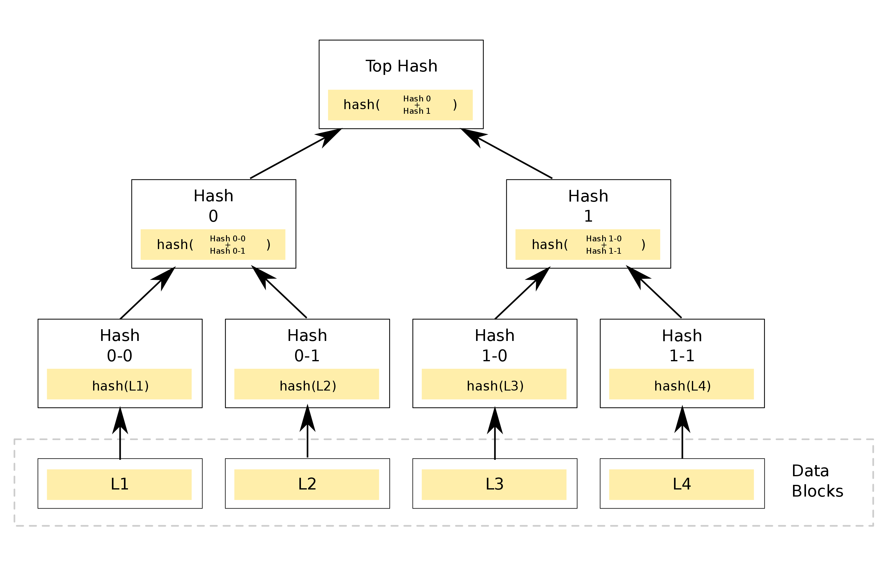

# Merkle Trees in C

---

- [Introduction](#introduction)
- [Repo Description](#repo-description)
  - [Repo Contents](#repo-contents)
- [Building `merkle_tree.c`](#building-merkle_treec)
- [Program Usage](#program-usage)
- [Playing Around](#playing-around)

---
## Introduction

There's plenty of information about Merkle Trees all over the interwebs and it's not going to be regurgitated, here. A simple online search will turn up any number of articles with varying levels of detail (and, frankly, quality). As usual, [Wikipedia](https://en.wikipedia.org/wiki/Merkle_tree) is as good a place to start as any. There's also a particularly good one by Marc Clifton at [The Code Project](https://www.codeproject.com/Articles/1176140/Understanding-Merkle-Trees-Why-use-them-who-uses-t).

Broadly, the problem Merkle Trees try to solve is that of data integrity and consistency. Imagine a large dataset maintained by multiple, untrusting, decentralised parties who each store their own copy. All these copies must remain in sync. How?

One solution is for each party to constantly receive copies of everyone else's dataset and run byte-by-byte comparisons against their own. Obviously, though, this is inefficient. Bandwidth costs alone can make this solution prohibitive. They could mitigate this by agreeing to run a synchronisation just once per day or once per month, but what if this isn't frequent enough? What if the application the parties are serving requires near real-time consistency?

A more practical way is for a hashing algorithm to be run against each dataset and the resulting digest sent to every party for comparison. This will be a much smaller value (for instance, the SHA256 hashing algorithm is just 32-bytes in size). If one party has computed a different hash from their dataset when compared to another party, clearly they are out of sync and work must be done to remediate.

There is still one problem, though. While parties are better off with this solution because datasets with matching hash values need no work at all, for hash values that don't match, large amounts of bandwidth and processor time are still being used to locate and patch differences in datasets. All a mismatched hash does is tell a party there is a problem **somewhere** in their data. They've still got to scan it all to find it.

The next stage, then, is to split the dataset into blocks and compute a hash value for each block. Now, every party has a list of hashes to compare and it only needs to re-synchronise blocks where the hash comparisons fail. There are still multiple hashes flying around the system, though, and while it's, no doubt, faster, parties must maintain lists of which hashes represent which blocks and maintain these lists.

So, the final step? A Merkle Tree.

A list of blocks and their associated hashes have been prepared. The hashes are extracted into a list which forms the bottom layer, or leaves, of the Merkle Tree. The list is then split into pairs of hashes and the left and right hashes each pair are concatenated, then hashed again. These new hashes form the next layer up of the tree. This process continues until there is only one hash left, known as the root hash.

For any layer with an odd number of hashes (that is, a layer that cannot be split into left and right pairs evenly), the last hash is duplicated and used as the right hand hash.

The root hash is then sent around the system and compared with every other party's root hash. If they are found to be different then a comparison is run in which trees are be traversed from top-down to find the point at which the hashes changed. This will lead to the offending data-block which can be patched and the root regenerated. This process continues until the root hashes match.


*Image by Azaghal - Own work, CC0, https://commons.wikimedia.org/w/index.php?curid=18157888*

---
## Repo Description

This repo contains a basic implementation of a Merkle Tree written in C which uses files of words, separated by newline, as input. Quite why anybody would want to do such a thing in real-life is beyond me (maybe multiple parties on a system need to keep an English dictionary in sync for some reason!) but it means that it's easy to get hold of a sizeable chunk of test data in a simple format by downloading one of the many available text files out there that contain the English dictionary. One can be found in this repo by looking in the `./test-data` directory. It was downloaded from: [https://github.com/dwyl/english-words](https://github.com/dwyl/english-words).

### Repo Contents

| ARTIFACT  | DESCRIPTION  |
|---|---|
| `./cakelog/`  | Source for the logger used to output debug information [https://github.com/chris-j-akers/cakelog](https://github.com/chris-j-akers/cakelog). Needs to be compiled with `merkle_tree.c`   |
| `./test_data/`  | Contains a sample test data file of english words, as described above.  |
| `merkle_tree.c`  | Source  |
| `README.md`  | This README file  |
|  `./README.md_img/` | Accompanying images for this file  |

---

## Building `merkle_tree.c`

[OpenSSL](https://www.openssl.org/source/) is used to generate the SHA256 hash digests in this program so you will need the OpenSSL libraries installed on your system before it will compile properly. Instructions can be found at [https://www.howtoforge.com/tutorial/how-to-install-openssl-from-source-on-linux](https://www.howtoforge.com/tutorial/how-to-install-openssl-from-source-on-linux)
  
To generate an executable called `mtree`, execute the following command from the repo directory:

`gcc merkle_tree.c ./cakelog/cakelog.c -o mtree -lssl -lcrypto -lm`

---

## Program Usage

Once the program has compiled to get the root has of the example data set (466,549 words) execute:

`➜ ./mtree ./test_data/ukenglish.txt`

The following output should be displayed:

```
reading file ./test_data/ukenglish.txt
read 466550 words into buffer
building leaves...
building tree ...
allocated space for 233275 node pointers in next_layer at address 0x7feb67f47010
allocated space for 116638 node pointers in next_layer at address 0x7feb67e63010
allocated space for 58319 node pointers in next_layer at address 0x7feb67df1010
allocated space for 29160 node pointers in next_layer at address 0x7feb67db8010
allocated space for 14580 node pointers in next_layer at address 0x556c51970d70
allocated space for 7290 node pointers in next_layer at address 0x556c51bc6e30
allocated space for 3645 node pointers in next_layer at address 0x556c51cf1ee0
allocated space for 1823 node pointers in next_layer at address 0x556c51d87780
allocated space for 912 node pointers in next_layer at address 0x556c51dd2470
allocated space for 456 node pointers in next_layer at address 0x556c51df7b90
allocated space for 228 node pointers in next_layer at address 0x556c51e0a770
allocated space for 114 node pointers in next_layer at address 0x556c51e13db0
allocated space for 57 node pointers in next_layer at address 0x556c51e18920
allocated space for 29 node pointers in next_layer at address 0x556c51e1af20
allocated space for 15 node pointers in next_layer at address 0x556c48f826f0
allocated space for 8 node pointers in next_layer at address 0x556c51e1cd30
allocated space for 4 node pointers in next_layer at address 0x556c51e1d310
allocated space for 2 node pointers in next_layer at address 0x556c51e1d650
allocated space for 1 node pointers in next_layer at address 0x556c51e1d840

================================================================================
Root digest is: bc4550eaefb5c8cc2ea917f3533b1e4635ffa232555de1d80f82634514223a35
================================================================================
```

The root hash of the dataset (466,549 words) is:

```
bc4550eaefb5c8cc2ea917f3533b1e4635ffa232555de1d80f82634514223a35
```

This hash will never change no matter how many times the program is run against this dataset, and with it being only 64-characters long (or 32-bytes as it's internal representation) this 'fingerprint' is trivial to pass to multiple parties so they can use it in comparison with their own root hash generated from their version of this dataset. What's more, the SHA256 hash algorithm is a well-known standard. As long as other parties are using this same algorithm they don't need to use `mtree` to calculate the root hash of their datasets. They don't even need to use the same language.


 to confirm they have exactly the same data. What's more, I'm using the SHA256 hash algorithm (from the OpenSSL library), a well-known standard, so as long as other parties are also using the SHA256 hash algorithm when building their tree they don't even need to use my `mtree`, they can write their own program in whichever language they want.

To prove this I ran a few examples where I changed the dataset slightly to see what happened.

## Playing Around

First, say I erased the word: `War` from the file (Lennon would be proud!)


If we run the program again, the hash result is not just different, but completely different.


I can also put `War` back into the file in exactly the same place and I will get my original root hash digest.

Even changing a single letter in our dataset will result in a very different root hash digest. For instance, adding an extra `n` to the word `banana`.


Still, a very different hash result:


So, this is the power of Merkle Trees. No matter how big your dataset is, you can reduce it to a single hash value and that value can be used to compare with other datasets to verify they are identical.

This data-structure is used heavily in blockchains and can also be used to verify large data transfers, especially when those transfers split the data up into blocks.


